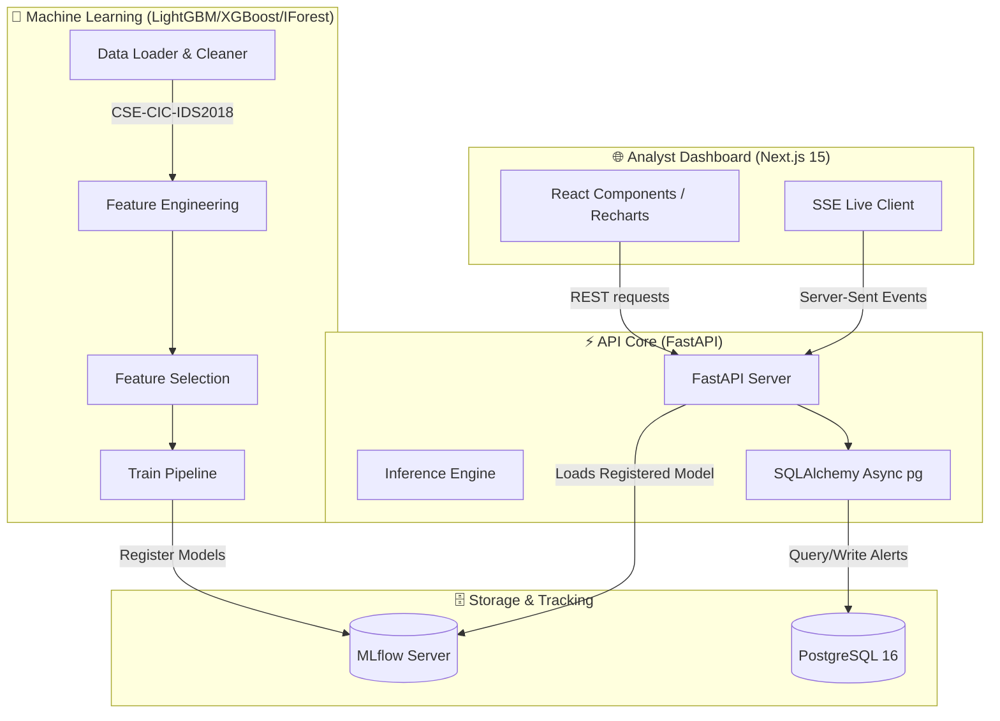

# Architecture & Design Specifications

This document outlines the technical design, data flows, and architectural paradigms of **TheAutisticNIDS** (Network Intrusion Detection System).

---

## 🏛️ System Architecture Overview

The system is organized as a high-performance, decoupled monorepo composed of four primary subsystems:

---

## 📁 Subsystem Specifications

### 1. 🔬 Machine Learning Track (`ml/`)
Designed for robust off-line training, feature optimization, and validation on high-volume datasets.
- **Data Ingestion (`ml/src/data/loader.py`)**: Responsible for sanitizing raw CSE-CIC-IDS2018 CSV inputs. Replaces infinite/NaN values, handles label misspelling, and implements a time-window deduplication rule to ensure that identical network packets do not pollute both the training and test splits.
- **Feature Engineering (`ml/src/features/engineering.py`)**: Computes 12 network-domain derived features (such as flag ratios and packet-to-byte volume indices) and applies adaptive log-transformations to skewed predictors (e.g., flow durations).
- **Feature Selection (`ml/src/features/selection.py`)**: Filters the raw 80-feature space using Random Forest permutation feature importance down to the top 30-40 features. It also runs a validator validating whether features can be extracted from live Suricata EVE logs.
- **Models (`ml/src/models/`)**: Focuses on high-performance tree classifiers (LightGBM and XGBoost). Implements class-weighted losses to address high class imbalance (e.g., millions of benign packets versus hundreds of specific exploits) and registers hyperparameter runs directly into MLflow.

### 2. ⚡ API Core (`api/`)
An asynchronous python layer designed to handle low-latency request serving, database queries, and ML model retrieval.
- **Framework**: Built on FastAPI leveraging Python's `asyncio` loop. All routing handles asynchronous tasks (`async`/`await`).
- **Database Engine**: Communicates with PostgreSQL via `SQLAlchemy` using the `asyncpg` async driver. Connection pools are established on server lifespan startup and cleaned up on shutdown.
- **Model Loader**: On server startup, FastAPI polls the configured MLflow tracking server, fetches the best model currently flagged for `Staging` (or `Production`), loads it into memory, and caches the inference graphs to guarantee hot-reload capability.
- **Migrations**: Alembic handles SQL generation. Database tables are designed to support upcoming deliverables (such as SHAP array storage and Tenant IDs) to prevent migrations from breaking downstream.

### 3. 🌐 Analyst Dashboard (`web/`)
A responsive, high-fidelity security operations console.
- **Framework**: Next.js 15 utilizing React, TypeScript, and Tailwind/Vanilla CSS configurations.
- **Data Visualization**: Customized charts (Area, Histogram, Donut, and Bar charts) built via Recharts to analyze attack vector frequencies, confidence metrics, and anomaly distributions.
- **Live Feed (Phase 4)**: Built utilizing Server-Sent Events (SSE). Unlike WebSockets, SSE uses unidirectional flow (Server-to-Client), works over standard HTTP, and has native client-side reconnection protocols, making it ideal for event monitoring.

---

## 🔒 Security Design & RLS

To prepare the platform for enterprise deployments in **Phase 6**, tenant isolation is baked directly into the foundation:
1. **Row-Level Security (RLS)**: Database tables containing `alerts`, `predictions`, `flows`, and analyst `verdicts` are built with a mandatory `tenant_id` column. PostgreSQL RLS policies block any database select/insert/update query that does not carry the verified `tenant_id` corresponding to the authenticated JSON Web Token (JWT).
2. **Authentication**: All client requests to `/predict` or `/alerts` are gated via JWT validation.

---

## 🔀 Active Learning & Analyst Feedback Loop

Starting in **Phase 5**, the NIDS switches from a static detection model to a continuous learning pipeline:
1. **Uncertainty Sampling**: Instead of showing analysts arbitrary alerts, the system prioritizes alerts with the *lowest prediction confidence* (near decision boundaries). Analyst actions on these alerts yield the highest performance gains when training.
2. **Auditing**: The `verdicts` table maintains a comprehensive audit trail of state changes (`New` -> `Confirmed Attack` or `False Positive`), tracking analyst IDs and reasoning for compliance auditing.
3. **Incremental Training**: Feedback samples are sent to an incremental model (e.g., Hoeffding Trees) to adapt to new zero-day variations without requiring a full model retrain.
