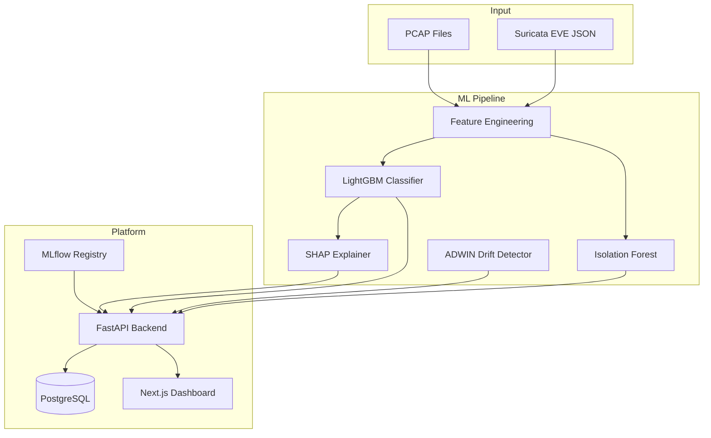

# TheAutisticNIDS: Network Intrusion Detection System

An **ML-powered network intrusion detection system** that enriches Suricata/Snort alerts with explainability (SHAP), anomaly detection (Isolation Forest), and concept drift awareness (ADWIN). Designed as a downstream ML enrichment layer, not a replacement for signature-based detection.

## Architecture



## Project Structure

```
├── ml/                     # ML Track — models, features, evaluation
│   ├── src/
│   │   ├── data/           # Data loading, cleaning, splitting
│   │   ├── features/       # Feature engineering & selection
│   │   ├── models/         # LightGBM, XGBoost training
│   │   ├── evaluation/     # Metrics, reports
│   │   └── explainability/ # SHAP (Phase 3)
│   ├── configs/            # Hyperparameter YAML files
│   └── tests/
├── api/                    # Web Track — FastAPI backend
│   ├── app/
│   │   ├── core/           # Config, settings
│   │   ├── db/             # SQLAlchemy models, Alembic migrations
│   │   ├── models/         # Pydantic schemas
│   │   ├── routes/         # API endpoints
│   │   └── services/       # Business logic
│   ├── migrations/         # Alembic migrations
│   └── tests/
├── web/                    # Dashboard — Next.js 15 (TypeScript)
│   └── src/app/            # App Router pages
├── docker-compose.yml      # Full dev stack
└── Docs/                   # Project specifications
```

## Quick Start

### Prerequisites

- Python 3.11+
- Node.js 20+
- Docker & Docker Compose

### Development Setup

```bash
# Clone and enter the project
git clone <repo-url>
cd Net_Attack_detection

# Copy environment file
cp .env.example .env

# Start the full stack
docker-compose up

# Or run services individually (using uv workspace):

# 1. Synchronize the monorepo workspace dependencies
uv sync

# 2. Run ML tests
uv run pytest ml/tests/

# 3. Start the API server
uv run --package nids-api uvicorn app.main:app --reload

# 4. Start Dashboard
cd web
npm install
npm run dev
```

### Services

| Service | URL | Description |
|---------|-----|-------------|
| Dashboard | http://localhost:3000 | Next.js analyst dashboard |
| API | http://localhost:8000 | FastAPI backend |
| API Docs | http://localhost:8000/docs | OpenAPI interactive docs |
| MLflow | http://localhost:5000 | Experiment tracking |
| PostgreSQL | localhost:5432 | Database |

## Tech Stack

| Component | Technology |
|-----------|-----------|
| Supervised Classifier | LightGBM (primary), XGBoost (baseline) |
| Anomaly Detector | Isolation Forest |
| Explainability | SHAP TreeExplainer |
| Drift Detection | River ADWIN |
| API Backend | FastAPI + SQLAlchemy + Alembic |
| Database | PostgreSQL |
| Dashboard | Next.js 15 + Recharts |
| Model Registry | MLflow |
| Containerisation | Docker Compose |
| Dataset | CSE-CIC-IDS2018 |

## Phased Roadmap

| Phase | ML Track | Web Track |
|-------|----------|-----------|
| **1** ✨ | Baseline LightGBM/XGBoost classifier | FastAPI skeleton + PostgreSQL + Next.js shell |
| **2** | Isolation Forest anomaly detection | Dashboard foundation with charts |
| **3** | SHAP explainability | SHAP visualisation + alert investigation |
| **4** | Live Suricata ingestion + ADWIN drift | Real-time SSE dashboard + Grafana |
| **5** | Active learning pipeline | Case management UI |
| **6** | Oracle VPS deployment | Multi-tenant RLS + JWT auth |
| **7** | Research extensions | Advanced features |

## Documentation

- [Project Specification](Docs/project_spec.md)
- [Architecture & Stack](Docs/architecture_and_stack.md)
- [Phased Deliverables](Docs/phased_deliverables.md)
- [Governance & Evaluation](Docs/governance_and_evaluation.md)

## License

This project is for educational and research purposes.
